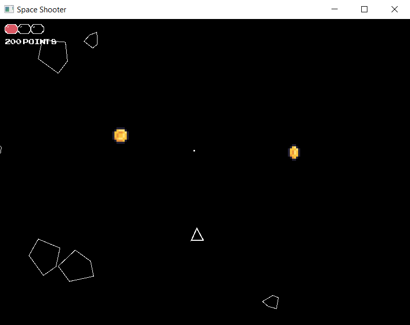

# Space Shooter

A classic arcade-style space shooter built in **C++** with **SFML 2**. Pilot a ship, destroy incoming meteorites, and rack up points — all rendered with a retro aesthetic.


---

## Screenshot



---

## Features

- **Mouse-aimed ship** — the player triangle always rotates to face the cursor
- **Meteorite splitting** — shooting a big meteorite breaks it into two smaller ones flying in opposite directions
- **Coin drops** — destroyed meteorites drop animated coins
- **Health system** — 3 health points with invincibility frames after taking damage
- **Point scoring** — displayed in a retro arcade font
- **Sprite animation** — frame-based animation system for coins and the health bar

---

## Controls

| Action | Input |
|---|---|
| Move | `W` `A` `S` `D` |
| Aim | Mouse |
| Shoot | `Space` |
| Quit | `Escape` or close window |

---

## Building & Running

### Prerequisites

- GCC / Clang / MSVC with C++17 support
- [SFML 2.6.1](https://www.sfml-dev.org/download/sfml/2.6.1/) — use **SFML 2.x**, not SFML 3 (breaking API changes)
- [CMake 3.16+](https://cmake.org/download/)

---

### Windows (VS Code + MinGW)

**1. Install SFML 2.6.1**

Download the **GCC SEH 64-bit** package from https://www.sfml-dev.org/download/sfml/2.6.1/ and extract it to `C:\SFML-2.6.1`.

**2. Clone and configure**

```bash
git clone https://github.com/your-username/space-shooter-sfml.git
cd space-shooter-sfml
cmake -B build -G "MinGW Makefiles" -DSFML_DIR="C:/SFML-2.6.1/lib/cmake/SFML"
```

**3. Build**

```bash
cmake --build build
```

**4. Copy SFML DLLs**

```bash
copy "C:\SFML-2.6.1\bin\sfml-graphics-2.dll" build\
copy "C:\SFML-2.6.1\bin\sfml-window-2.dll" build\
copy "C:\SFML-2.6.1\bin\sfml-system-2.dll" build\
copy "C:\SFML-2.6.1\bin\sfml-graphics-d-2.dll" build\
copy "C:\SFML-2.6.1\bin\sfml-window-d-2.dll" build\
copy "C:\SFML-2.6.1\bin\sfml-system-d-2.dll" build\
```

**5. Run**

```bash
.\build\SpaceShooter.exe
```

---

### macOS

```bash
brew install sfml@2 cmake
git clone https://github.com/your-username/space-shooter-sfml.git
cd space-shooter-sfml
cmake -B build
cmake --build build
./build/SpaceShooter
```

---

### Linux (Ubuntu/Debian)

```bash
sudo apt install libsfml-dev cmake build-essential
git clone https://github.com/your-username/space-shooter-sfml.git
cd space-shooter-sfml
cmake -B build
cmake --build build
./build/SpaceShooter
```

---

## Project Structure

```
src/
├── main.cpp               # Entry point
├── Engine.{h,cpp}         # Window, game loop, texture loading
├── Player.{h,cpp}         # Ship movement, aiming, health, collision
├── Bullet.{h,cpp}         # Bullet movement and collision detection
├── Meteorite.{h,cpp}      # Base meteorite class (movement, AI, bounds wrapping)
├── BigMeteorite.{h,cpp}   # Large meteorite — splits into two small ones on hit
├── SmallMeteorite.{h,cpp} # Small meteorite fragment
├── Coin.{h,cpp}           # Coin drop with sprite animation
├── HealthBar.{h,cpp}      # Animated health bar display
└── Animation.{h,cpp}      # Frame-based sprite animation system
assets/
├── coin_sheet.png          # Coin sprite sheet
└── health_bar_sheet.png    # Health bar sprite sheet
fonts/
└── ARCADECLASSIC.TTF       # Retro arcade font
```

---

## License

[MIT](LICENSE.txt)
